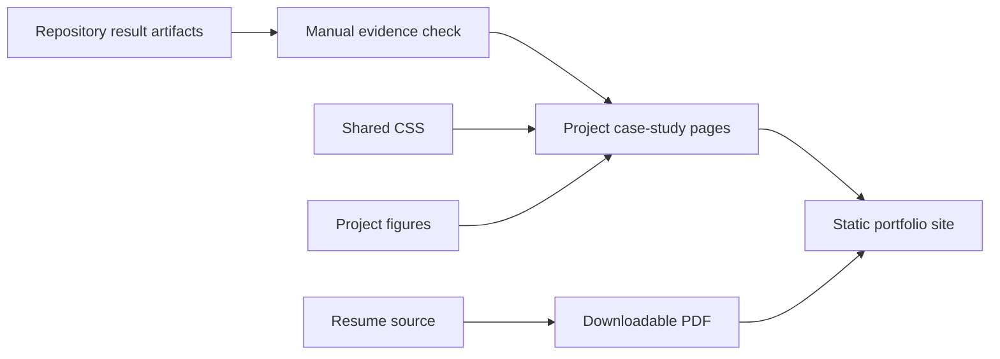

# Site architecture

The site is intentionally static. Project pages summarize checked-in repository
results, while the repositories remain the source of record. Shared styles keep
the pages consistent without adding a JavaScript framework or build pipeline.

When a project result changes, update the repository artifact first, then its
case study, profile README, and resume. That order prevents the portfolio from
claiming work that the linked repository does not support.
